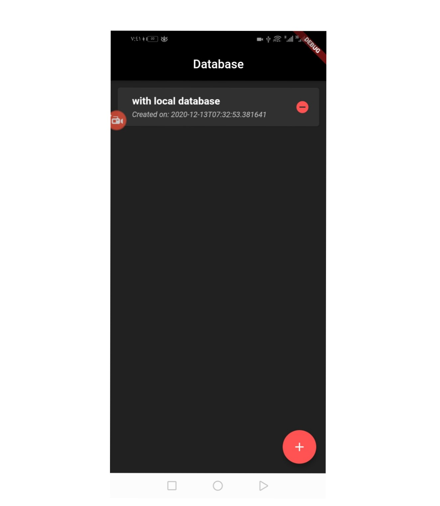

# database_sqf

Your browser does not support the video tag.
 <video width="320" height="240" autoplay>
  <source src="todo app.mp4" type="video/mp4">

Your browser does not support the video tag
</video> 

A new Flutter project.

# ScreenShot Images

## Getting Started

This project is a starting point for a Flutter application.

A few resources to get you started if this is your first Flutter project:

- [Lab: Write your first Flutter app](https://flutter.dev/docs/get-started/codelab)
- [Cookbook: Useful Flutter samples](https://flutter.dev/docs/cookbook)

For help getting started with Flutter, view our
[online documentation](https://flutter.dev/docs), which offers tutorials,
samples, guidance on mobile development, and a full API reference.
